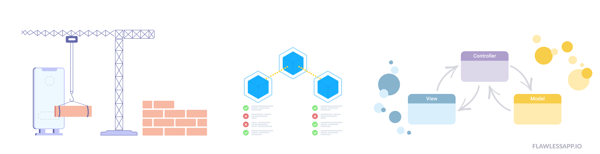
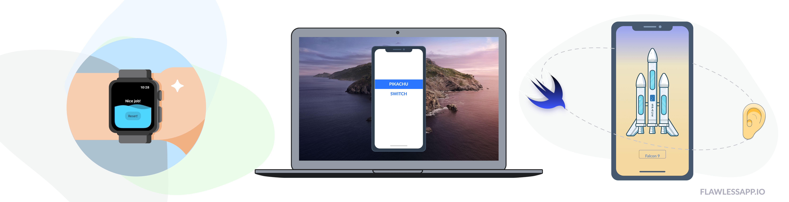
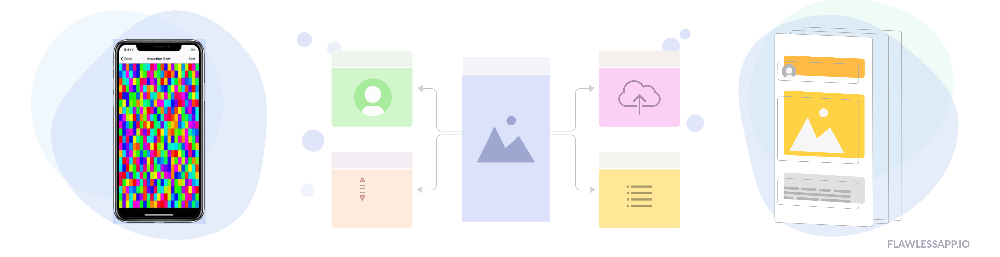

   

Hey to all the mobile community! Since 2016 we have been curating [Flawless iOS](https://medium.com/flawless-app-stories), a community-driven blog about iOS development. So far it's the biggest iOS blog on Medium with both beginner and advanced iOS guides, written by fellow developers. Updated almost every day.

We're proud to have more than 80 writers and 200+ free iOS guides published within Flawless iOS Medium blog. In this repo you can find all of them, nicely categorized. Learn from these comprehensive guides, share your articles with us and **[follow Flawless iOS publication on Medium](https://medium.com/flawless-app-stories)**.

   

## Table of Content
* [Architecture](#architecture)
  * [MVC](#mvc)
  * [MVVM](#mvvm)
  * [Modular Architecture](#modular-architecture)
  * [Viper](#viper)
* [Auto Layout](#auto-layout)
* [Closures](#closures)
* [CocoaPods](#cocoapods)
* [Combine](#combine)
* [Concurrency](#concurrency)
* [Continuous Integration & Continuous Delivery](#continuous-integration--continuous-delivery)
* [Curation](#curation)
* [Data Structure](#data-structure)
* [Debugging](#debugging)
* [Deep Dive](#deep-dive)
* [Dependency Injection](#dependency-injection)
* [Design System](#design-system)
* [Flawless App](#flawless-app)
* [Flutter](#flutter)
* [Frameworks](#frameworks)
* [Git](#git)
* [How to Implement an App: Case-Studies](#how-to-implement-an-app-case-studies)
* [Image](#image)
* [Implementing Animations in iOS](#implementing-animations-in-ios)
* [Implementing Integrations](#implementing-integrations)
* [iOS](#ios)
   * [iOS 11](#ios-11)
   * [iOS 12](#ios-12)
   * [iOS 13](#ios-13)
* [iOS Simulator](#ios-simulator)
* [iPadOS](#ipados)
* [JSON Parsing](#json-parsing)
* [Localisation](#localisation)
* [Machine Learning in iOS](#machine-learning-in-ios)
* [Making Xcode Work Better for You](#making-xcode-work-better-for-you)
* [Memory Management](#memory-management)
* [Navigation](#navigation)
* [Patterns](#patterns)
* [Playgrround](#playgrround)
* [Protocols](#protocols)
* [Push Notifications](#push-notifications)
* [RxSwift](#rxswift)
* [Siri](#siri)
* [Soft Skills](#soft-skills)
* [Sourcery](#sourcery)
* [Speeding up workflow & productivity tips](#speeding-up-workflow--productivity-tips)
* [Storyboards](#storyboards)
* [Swift](#swift)
* [SwiftUI](#swiftui)
* [Testing](#testing)
* [Texture](#texture)
* [Tutorial](#tutorial)
* [UIKit](#uikit)
* [URLs](#urls)
* [UX & UI design for mobile developers](#ux--ui-design-for-mobile-developers)
* [White Label Solutions](#white-label-solutions)
* [Writing Better Code](#writing-better-code)
* [3D Touch](#3d-touch)

## Architecture
* [The only viable iOS architecture](https://medium.com/flawless-app-stories/the-only-viable-ios-architecture-c42f7b4c845d) by Amirzhan Idryshev

### MVC+
* [“Massive” View Controllers or bad coding style?](https://medium.com/flawless-app-stories/massive-view-controllers-or-bad-coding-style-bf2b0d57c268) by Besar
* [Judging MVC](https://medium.com/@iAmrSalman/judging-mvc-1b4f1850661c) by Amr Salman

### MVVM
* [How not to get desperate with MVVM implementation](https://medium.com/flawless-app-stories/how-to-use-a-model-view-viewmodel-architecture-for-ios-46963c67be1b?) by S.T.Huang
* [A taste of MVVM and Reactive paradigm](https://flawlessapp.io/blog/a-taste-of-mvvm-and-reactive-paradigm/) by Khoa Pham
* [Advanced iOS tutorial on MVVM](https://medium.com/flawless-app-stories/advanced-ios-tutorial-use-mvvm-to-tackle-complicated-tableview-a2386ee817a9) by S.T.Huang
* [Applying Unit Tests to MVVM with Swift](https://medium.com/flawless-app-stories/applying-unit-tests-to-mvvm-with-swift-ba5a79df8a18) by S.T.Huang
* [Practical MVVM + RxSwift](https://medium.com/flawless-app-stories/practical-mvvm-rxswift-a330db6aa693) by Mohammad Zakizadeh
* [Fighting state redundancy in MVVM](https://medium.com/flawless-app-stories/mvvm-state-redundancy-c9e079ff02f3) by Alexey Naumov

### Modular Architecture
* [Modular Architecture in iOS](https://medium.com/flawless-app-stories/a-modular-architecture-in-swift-aafd9026aa99) by Leandro Pérez
* [Speed Up your iOS Development: The Modules’s Paradigm](https://medium.com/flawless-app-stories/speed-up-your-ios-development-the-moduless-paradigm-part-1-1aab9fae02cd) by Francisco Javier Trujillo Mata

### Viper 
* [Implementing VIPER Architecture Pattern for iOS](https://medium.com/flawless-app-stories/implementing-viper-archticture-pattern-for-ios-d24a6def8ba2) by Mahdi Chtioui
* [App Architecture and Object Composition in Swift](https://medium.com/flawless-app-stories/app-architecture-and-object-composition-in-swift-c9101a9e37e3) by Dmytro Anokhin

    

## Auto Layout
* [How to make Auto Layout more convenient in iOS](https://medium.com/flawless-app-stories/how-to-make-auto-layout-more-convenient-in-ios-df3b42fed37f) by Khoa Pham

## Closures
* [Simplifying communication patterns with closure in Swift](https://medium.com/flawless-app-stories/simplifying-communication-patterns-with-closure-in-swift-1938414468b3) by Khoa Pham
* [You don’t (always) need [weak self]](https://medium.com/flawless-app-stories/you-dont-always-need-weak-self-a778bec505ef) by Besher Al Maleh
* [Closure in Swift: The Painful one!](https://medium.com/flawless-app-stories/closure-in-swift-the-painful-one-7daff52a6e3f) by Shubham Bakshi
* [Unowned vs Weak](https://medium.com/flawless-app-stories/unowned-vs-weak-614ac71ac516) by Fahad C H

## CocoaPods
* [Create your own CocoaPods library](https://medium.com/flawless-app-stories/create-your-own-cocoapods-library-da589d5cd270) by Yong Su

## Combine
* [Problem Solving with Combine Swift](https://medium.com/flawless-app-stories/problem-solving-with-combine-swift-4751885fda77) by Arlind Aliu
* [Will Combine kill RxSwift?](https://medium.com/flawless-app-stories/will-combine-kill-rxswift-64780a150d89) by MortyMerr
* [Visualize Combine Magic with SwiftUI Part 1](https://medium.com/flawless-app-stories/visualize-combine-magic-with-swiftui-part-1-3a56e2a461b3) by Kevin Cheng
* [Visualize Combine Magic with SwiftUI Part 3](https://medium.com/flawless-app-stories/visualize-combine-magic-with-swiftui-part-3-a3f0cc42bcc8) by Kevin Cheng
* [Visualize Combine Magic with SwiftUI Part 5](https://medium.com/flawless-app-stories/visualize-combine-magic-with-swiftui-part-5-2783adddbd1d) by Kevin Cheng

## Concurrency
* [Parallel Programming with Swift: What could possibly go wrong?](https://medium.com/flawless-app-stories/parallel-programming-with-swift-what-could-possibly-go-wrong-f5bcc38b1814) by Jan Olbrich
* [Parallel programming with Swift: Basics](https://medium.com/flawless-app-stories/basics-of-parallel-programming-with-swift-93fee8425287) by Jan Olbrich
* [Parallel programming with Swift: Operations](https://medium.com/flawless-app-stories/parallel-programming-with-swift-operations-54cbefaf3cb0) by Jan Olbrich
* [Parallel programming with Swift: Promises](https://medium.com/flawless-app-stories/parallel-programming-with-swift-promises-740be1a260ed) by Jan Olbrich
* [Multithreaded Programming in iOS](https://medium.com/flawless-app-stories/multithreaded-programming-in-ios-9de206afa620) by Medi Assumani
* [GPU Speedup](https://medium.com/flawless-app-stories/gpu-speedup-5cd66012b91e) by Mohammad Jeragh

## Continuous Integration & Continuous Delivery
* [How to set up your iOS project with Continuous Integration and Delivery](https://medium.com/flawless-app-stories/how-to-setup-your-ios-project-with-ci-cd-1abc48b6755f) by Lawrence Tan
* [How to set up GitLab Continuous Integration for iOS projects without a hassle](https://medium.com/flawless-app-stories/how-to-set-up-gitlab-continuous-integration-for-ios-projects-without-a-hustle-53c2b642c90f) by Victor Peschenkov
* [Build it, Test it, Deliver it! Complete iOS Guide on Continuous Delivery with fastlane and Jenkins](https://medium.com/flawless-app-stories/build-it-test-it-deliver-it-complete-ios-guide-on-continuous-delivery-with-fastlane-and-jenkins-cbe44e996ac5) by S.T.Huang
* [Automate your iOS apps using Bitrise](https://medium.com/flawless-app-stories/automate-your-ios-apps-using-bitrise-6ded1712842b) by Gokhan Gultekin
* [Continuous Integration for Flutter with Codemagic](https://medium.com/flawless-app-stories/continuous-integration-for-flutter-with-codemagic-239aa206a70) by Codemagic
* [iOS Continuous Integration with GitLab CI, Fastlane & OTA Installation](https://medium.com/flawless-app-stories/ios-continuous-integration-with-gitlab-ci-fastlane-and-ota-installation-from-gitlab-pages-f312e07ab06e) by Leszek Szary
* [Secret variables in Xcode AND your CI for fun and profit](https://medium.com/flawless-app-stories/secret-variables-in-xcode-and-your-ci-for-fun-and-profit-d387a50475d7) by Robin Malhotra

    

## Curation
* [Awesome Ladies iOS Engineers to Follow on Twitter](https://medium.com/flawless-app-stories/awesome-ladies-ios-engineers-to-follow-on-twitter-4fd9dff8b242) by Lisa Dziuba
* [15 great iOS newsletters you should know about](https://medium.com/flawless-app-stories/15-great-ios-newsletters-you-should-know-about-e32978dd20e1) by Lisa Dziuba
* [33 awesome GitHub lists for iOS development](https://medium.com/flawless-app-stories/33-awesome-github-lists-for-ios-development-336691520d0f) by Lisa Dziuba
* [Best resources for Advanced iOS Developer (Swift)](https://medium.com/flawless-app-stories/best-resources-for-advanced-ios-developer-swift-ade30374593d) by Pavlo Shadov

## Data Structure
* [Doubly Linked Lists — Swift 4](https://medium.com/flawless-app-stories/doubly-linked-lists-swift-4-ae3cf8a5b975) by Sarin Swift
* [Error trees in iOS](https://medium.com/flawless-app-stories/error-trees-d88df217bcc4) by Isaac Carol Weisberg

## Debugging
* [Advanced debugging with Xcode](https://medium.com/flawless-app-stories/advanced-debugging-with-xcode-5e6c8dabd311) by Vincent Pradeilles
* [Bringing awesome logs to your iOS app](https://medium.com/flawless-app-stories/bringing-awesome-logs-to-your-ios-app-70c18e891723) by Vincent Pradeilles

## Deep Dive
* [IPC — Mach Message](https://medium.com/flawless-app-stories/ipc-mach-message-cab64ff1b569) by Ali Pourhadi

## Dependency Injection
* [iOS Dependency Injection Using Swinject](https://medium.com/flawless-app-stories/ios-dependency-injection-using-swinject-9c4ceff99e41) by Ali Akhtar

## Design System
* [What Design Language System looks from the engineers’ side?](https://medium.com/flawless-app-stories/what-design-language-system-looks-from-the-engineers-side-54f8e2f0ec1e) by Sting.Su

## Flawless App
* [How Flawless App will make you a better UI designer](https://medium.com/flawless-app-stories/how-flawless-app-will-make-you-a-better-ui-designer-23c7c5338e8c) by Ahmed Sulaiman
* [Flawless App update: redesigned UI and UX, dark mode and optimised file selection](https://medium.com/flawless-app-stories/flawless-app-update-redesigned-ui-and-ux-dark-mode-and-optimised-file-selection-8675e4751f10) by Flawless App

## Flutter
* [Flutter vs React Native: A Developer’s Perspective](https://medium.com/flawless-app-stories/flutter-vs-react-native-a-developers-perspective-8914ca240a89) by Codemagic
* [Flutter: TDD with Unit Tests](https://medium.com/flawless-app-stories/flutter-tdd-with-unit-tests-5aa73ec3bce5) by Lawrence Tan

## Frameworks
* [Getting Started with Reusable Frameworks for iOS Development](https://medium.com/flawless-app-stories/getting-started-with-reusable-frameworks-for-ios-development-f00d74827d11) by Alec O'Connor
* [Improve your iOS team’s productivity by building features as frameworks](https://medium.com/flawless-app-stories/improve-your-ios-teams-productivity-by-building-features-as-frameworks-9d2a64cbcab5) by Alexander Freas

## Git
* [Useful git commands for everyday use!](https://medium.com/flawless-app-stories/useful-git-commands-for-everyday-use-e1a4de64037d) by Khoa Pham

## How to Implement an App: Case-Studies
* [A Christmas Challenge — A Cinema app in just 7 days](https://medium.com/flawless-app-stories/a-christmas-challenge-a-cinema-app-in-just-7-days-1c9aa998e765) by James Sherlock
* [How I created Apple’s Voice Memos clone](https://medium.com/flawless-app-stories/how-i-created-apples-voice-memos-clone-b6cd6d65f580) by Hassan El Desouky
* [Creating Game of Life on iOS](https://medium.com/flawless-app-stories/creating-game-of-life-on-ios-73bd51b63430) by Arlind Aliu
* [How you can build a private photo-sharing app in 30 minutes with Creo](https://medium.com/flawless-app-stories/how-you-can-build-a-private-photo-sharing-app-in-30-minutes-with-creo-7517e79df943) by Massimo Sgrelli
* [Implementing Foldable, Map and FlatMap](https://medium.com/flawless-app-stories/foldable-map-and-flatmap-416dbd5ace36) by Tyrone Michael Avnit

## Image
* [Image Cropping in Swift](https://medium.com/flawless-app-stories/image-cropping-swift-26dfb09d3eae) by Ashok Kumar

## Implementing Animations in iOS
* [Delightful animations in iOS](https://medium.com/flawless-app-stories/delightful-animations-in-ios-7607e49945eb) by Roland Leth
* [Using Sky Segmentation to create stunning background animations in iOS](https://medium.com/flawless-app-stories/using-sky-segmentation-to-create-stunning-background-animations-in-ios-4b4b2548061) by Eric Hsiao
* [Cool Custom ViewController Transitions — Easy](https://medium.com/flawless-app-stories/cool-view-controller-transitions-easy-8390bd8e378) by Fran Obarrio
* [Cool Custom ViewController Transitions — Advanced](https://medium.com/flawless-app-stories/cool-custom-view-controller-transitions-advanced-df2d0ca08029) by Fran Obarrio
* [Animated gradient layers in Swift](https://medium.com/flawless-app-stories/animated-gradient-layers-in-swift-bad094496644) by Prabhu S
* [RxAnimated — animated bindings](https://medium.com/flawless-app-stories/rxanimated-animated-bindings-c5daa7f7d591) by Stfalcon.com

    

## Implementing Integrations
* [Facebook Account Kit using Swift](https://medium.com/flawless-app-stories/facebook-account-kit-using-swift-1dfee31ce9dd) by Anas Zaheer
* [Unity Integration in Native iOS & APIs](https://medium.com/flawless-app-stories/unity-integration-in-native-ios-b5e2ea501477) by Azeem Azeez
* [Scratching the Firebase services with your iOS app](https://medium.com/flawless-app-stories/scratching-the-firebase-services-with-your-ios-app-c2746881c6d8) by Deyan Aleksandrov
* [Managing your App Distribution with Firebase](https://medium.com/flawless-app-stories/managing-your-app-distribution-using-firebase-b0e0178eedb) by Nabil Kazi

## iOS
### iOS 11
* [Sneak peek into iOS 11 Drag & Drop API using Swift](https://medium.com/flawless-app-stories/sneak-peek-into-ios-11-drag-drop-api-using-swift-14170021a671) by Yuri Chukhlib

### iOS 12

* [All about iOS 12 Autofill Passwords Tool API’s](https://medium.com/flawless-app-stories/all-about-ios-12-autofill-passwords-tool-apis-8f095127fd99) by Ali Akhtar

### iOS 13
* [How To Prepare Your App For iOS 13](https://medium.com/flawless-app-stories/how-to-prepare-your-app-for-ios-13-7ea95c3e5433) by Attia Mo
* [A “Swifty” way to pick Documents](https://medium.com/flawless-app-stories/a-swifty-way-to-pick-documents-59cad1988a8a) by Abraham Mangona
* [iOS 13 UISegmentedControl: 3 important changes](https://medium.com/flawless-app-stories/ios-13-uisegmentedcontrol-3-important-changes-d3a94fdd6763) by Rostyslav Dovhaliuk
* [How to Request Device Motion and Orientation Permission in iOS 13](https://medium.com/flawless-app-stories/how-to-request-device-motion-and-orientation-permission-in-ios-13-74fc9d6cd140) by Lee Martin
* [How to use a full-text search on iOS?](https://medium.com/flawless-app-stories/how-to-use-full-text-search-on-ios-7cc4553df0e0) by Pavle Pesic
* [Handling iOS 13 Bluetooth Permissions](https://medium.com/flawless-app-stories/handling-ios-13-bluetooth-permissions-26c6a8cbb816) by Anupam Chugh
* [Backward compatible Dark Mode on iOS](https://medium.com/flawless-app-stories/backward-compatible-dark-mode-on-ios-1f55e31e4c0e) by Maksym Shcheglov
* [Enable Accessibility VoiceOver for ImageView in iOS 13 on Xcode with Swift](https://medium.com/flawless-app-stories/enable-accessibility-voiceover-for-uiimageview-in-ios-13-577aa4979d00) by Mumtaz Hussain
* [Implementing Dark Mode on iOS](https://medium.com/flawless-app-stories/implementing-dark-mode-on-ios-d195cac098de) by Bao Nguyen
* [Getting started with PencilKit on iOS 13](https://medium.com/flawless-app-stories/getting-started-with-pencilkit-on-ios-13-a4bda3323fd8) by Martin Mitrevski
* [iOS 13: Optical Character Recognition](https://medium.com/flawless-app-stories/ios-13-optical-character-recognition-d1bb8b710db1) by Chris Mash

    

## iOS Simulator
* [iOS Simulator on steroids: Tips & Tricks](https://medium.com/flawless-app-stories/simulator-on-steroids-c12774ca6b) by Ahmed Sulaiman

## iPadOS
* [Multi-window development in iPadOS](https://medium.com/flawless-app-stories/multi-window-development-in-ipados-cd6e5de0bc2c) by Chris Mash
* [Using native Apple’s Places](https://medium.com/flawless-app-stories/using-native-apples-places-f5a4a462a8e5) by Andrew Konovalskyi

## JSON Parsing
* [Let’s parse the JSON like a Boss with Swift Codable protocol](https://medium.com/flawless-app-stories/lets-parse-the-json-like-a-boss-with-swift-codable-protocol-3d4c4290c104) by Shakti Prakash

## Localisation
* [DRY String Localization with Interface Builder](https://medium.com/flawless-app-stories/dry-string-localization-with-interface-builder-665496eb0270) by Victor Pavlychko

## Machine Learning in iOS
* [iOS Vision And Highlighting Text With Core ML](https://medium.com/flawless-app-stories/ios-vision-and-highlighting-text-with-core-ml-aaca104e9427) by Anupam Chugh
* [Machine Learning in iOS: IBM Watson and CoreML](https://medium.com/flawless-app-stories/detecting-avengers-superheroes-in-your-ios-app-with-ibm-watson-and-coreml-fe38e493a4d1) by Khoa Pham
* [Machine Learning in iOS: Azure Custom Vision and CoreML](https://medium.com/flawless-app-stories/machine-learning-in-ios-azure-custom-vision-and-coreml-645e93f35eee) by Khoa Pham
* [Machine Learning in iOS: Turi Create and CoreML](https://medium.com/flawless-app-stories/machine-learning-in-ios-turi-create-and-coreml-5ddce0dc8e26) by Khoa Pham
* [Vision in iOS: Text detection and Tesseract recognition](https://medium.com/flawless-app-stories/vision-in-ios-text-detection-and-tesseract-recognition-26bbcd735d8f) by Khoa Pham

## Making Xcode Work Better for You
* [Become more productive and efficient in Xcode](https://medium.com/flawless-app-stories/become-more-productive-and-efficient-in-xcode-e2b5bc29f1ab) by Farhan Syed
* [One-Stop Xcode Coziness](https://medium.com/flawless-app-stories/one-stop-xcode-coziness-ee8dc9c1eb8b) by Wendy Liga
* [Optimize Swift build and compile times in Xcode](https://medium.com/flawless-app-stories/optimize-swift-build-and-compile-times-in-xcode-8a212e2e7d86) by Batikan
* [Improve your Xcode (Swift) Compile Time](https://medium.com/flawless-app-stories/improve-your-xcode-swift-compile-time-d9c1d3786473) by Alexandros Smponias
* [Essential Xcode Shortcuts for More Efficient Coding](https://medium.com/flawless-app-stories/essential-xcode-shortcuts-for-more-efficient-coding-1f8e58b2c907) by Peter Friese
* [Xcode 11 now makes “//MARK:” comments a lot more useful with Minimap feature](https://medium.com/flawless-app-stories/xcode-11-now-makes-mark-comments-a-lot-more-useful-with-minimap-feature-f8c658b293f) by Mumtaz Hussain

## Memory Management
* [Memory Leaks in Swift](https://medium.com/flawless-app-stories/memory-leaks-in-swift-bfd5f95f3a74) by Leandro Pérez
* [iOS Memory Management in Under 6 Minutes](https://medium.com/flawless-app-stories/ios-memory-management-in-under-6-minutes-3be777f69b7e) by Hassan El Desouky
* [Reducing Memory Footprint and OOM Terminations in iOS](https://medium.com/flawless-app-stories/techniques-to-reduce-memory-footprint-and-oom-terminations-in-ios-a0f6bef38217) by Leandro Pérez

## Navigation
* [Creating a UITabBarController Framework](https://medium.com/flawless-app-stories/creating-a-uitabbarcontroller-framework-8bd7b1289244) by Malcolm Kumwenda

## Patterns
* [Returning Error vs Throwing Error in Swift](https://medium.com/flawless-app-stories/returning-error-vs-throwing-error-in-swift-8d3657e1330d) by Lau Kwok Ping
* [Strategy pattern in Swift](https://medium.com/flawless-app-stories/strategy-pattern-in-swift-1462dbddd9fe) by Juanpe Catalán
* [Flow coordinator pattern on steroids](https://medium.com/flawless-app-stories/flow-coordinator-pattern-on-steroids-a52021e31bfe) by Pavle Pesic
* [An elegant pattern to craft cache-efficient functions in Swift](https://medium.com/flawless-app-stories/an-elegant-pattern-to-craft-cache-efficient-functions-in-swift-c1a18f73e28c) by Vincent Pradeilles
* [Design patterns by Tutorials— The power of OOP (part 1)](https://medium.com/flawless-app-stories/design-patterns-by-tutorials-the-power-of-oop-2e871b551cbe) by Hitendra Solanki
* [Design patterns by Tutorials — The power of OOP (part 3)](https://medium.com/flawless-app-stories/adapter-pattern-design-patterns-by-tutorials-the-power-of-oop-part-3-112a956c1101) by Hitendra Solanki
* [Builder Design Pattern in iOS](https://medium.com/flawless-app-stories/builder-design-pattern-in-ios-d528c7614eac) by Oguz Parlak

## Playgrround
* [Playground driven development in Swift](https://medium.com/flawless-app-stories/playground-driven-development-in-swift-cf167489fe7b) by Khoa Pham

## Protocols
* [Writing a Network Layer in Swift: Protocol-Oriented Approach](https://medium.com/flawless-app-stories/writing-network-layer-in-swift-protocol-oriented-approach-4fa40ef1f908) by Malcolm Kumwenda
* [Improving code testability with Swift protocols](https://medium.com/flawless-app-stories/solving-dependencies-in-swift-9ee6ad4a8941) by Juanpe Catalán
* [Protocol-based Themes in iOS Apps](https://medium.com/flawless-app-stories/protocol-based-themes-in-ios-apps-820971763837) by Muhammad Nayab Butt

## Push Notifications
* [iOS remote push notifications in a nutshell](https://medium.com/flawless-app-stories/ios-remote-push-notifications-in-a-nutshell-d05f5ccac252) by Deyan Aleksandrov
* [Strong-typed Notifications in Swift](https://medium.com/flawless-app-stories/strong-typed-notifications-in-swift-a5de8f7f58e0) by Leandro Pérez
* [iOS Dynamic Push Notifications with AWS Pinpoint](https://medium.com/flawless-app-stories/ios-push-notifications-with-aws-4bde95dfe7f4) by Marvin Mouroum
* [Local Notifications in Swift 5 and iOS 13 with UNUSerNotificationCenter](https://medium.com/flawless-app-stories/local-notifications-in-swift-5-and-ios-13-with-unusernotificationcenter-190e654a5615) by Lachlan Miller

## RxSwift
* [Simplifying RxSwift code](https://medium.com/flawless-app-stories/simplifying-rxswift-code-78071d5b780) by MortyMerr
* [Reactive Heart Rate Monitors in Swift](https://medium.com/flawless-app-stories/https-medium-com-leandromperez-reactive-heart-rate-monitors-9e68a31a88b) by Leandro Pérez
* [The state of modern Rx in iOS](https://medium.com/flawless-app-stories/rxflaws-state-of-modern-rx-in-ios-1ff2cae75fa3) by Isaac Carol Weisberg

## Siri
* [WWDC 2018 for iOS developers: Siri Shortcuts](https://medium.com/flawless-app-stories/wwdc-2018-for-ios-developers-siri-shortcuts-e8e4a78f0ad7) by Jan Olbrich
* [Ask user input from Siri in custom Intent for iOS 13](https://medium.com/flawless-app-stories/ask-user-input-from-siri-in-custom-intent-for-ios-13-3db243b9d739) by Abhilash Mathur

## Soft Skills
* [How I failed 39 interviews and what I’ve learned](https://medium.com/flawless-app-stories/how-i-failed-39-interviews-and-what-ive-learned-515c8e6c4b53) by Hassan El Desouky
* [How to get the first job as an iOS developer](https://medium.com/flawless-app-stories/14-resources-to-help-you-get-your-ios-engineering-job-1cca22cedafe) by Hassan El Desouky
* [How to maintain the focus as a software developer?](https://medium.com/flawless-app-stories/how-to-maintain-the-focus-as-a-software-developer-d43aeb25693c) by Pavle Pesic

## Sourcery
* [How to supercharge Swift enum-based states with Sourcery](https://medium.com/flawless-app-stories/enums-and-sourcery-5da57cda473b) by Alexey Demedeckiy

## Speeding up workflow & productivity tips
* [Squeezing Xcode for hard drive space](https://medium.com/flawless-app-stories/saving-space-as-an-ios-developer-c09f5b6af395) by Chris Mash
* [iOS project best practices and tools](https://medium.com/flawless-app-stories/ios-project-best-practices-and-tools-c46135b8116d) by Piotr Gorzelany
* [Make your next iOS project a huge success](https://medium.com/flawless-app-stories/make-your-next-ios-swift-project-a-huge-success-for-developers-f98c508299ff) by Alexandros Smponias
* [Achieving maximum test readability at no cost for iOS](https://medium.com/flawless-app-stories/ios-achieving-maximum-test-readability-at-no-cost-906af0dbaa98) by Victor Magalhães
* [Best iOS hacks from Twitter: October Edition](https://medium.com/flawless-app-stories/best-ios-hacks-from-twitter-october-edition-ce253347f88a) by Lisa Dziuba
* [Best iOS hacks from Twitter: November Edition](https://medium.com/flawless-app-stories/best-ios-hacks-from-twitter-november-edition-bd38edba8ea4) by Lisa Dziuba
* [Best iOS hacks from Twitter: December Edition](https://medium.com/flawless-app-stories/best-ios-hacks-from-twitter-december-edition-8134390309e2) by Lisa Dziuba
* [Best iOS hacks from Twitter: January & February Edition](https://medium.com/flawless-app-stories/best-ios-hacks-from-twitter-january-february-edition-4348c1caac2c) by Lisa Dziuba
* [Best iOS hacks from Twitter: March & April Edition](https://medium.com/flawless-app-stories/best-ios-hacks-from-twitter-march-april-edition-8b538f553c83) by Lisa Dziuba

    

## Storyboards
* [Will Storyboards still be alive?](https://medium.com/flawless-app-stories/storyboard-or-no-storyboard-d3ce6eda91eb) by Nabil Kazi
* [Reducing iOS storyboard merge hell](https://medium.com/flawless-app-stories/ios-storyboard-merge-hell-b4cbb2e57dfc) by Chris Mash

## Swift
* [UndoManager in Swift 5 with example](https://medium.com/flawless-app-stories/undomanager-in-swift-5-with-simple-example-8c791e231b87) by Hitendra Solanki
* [Disjoint-set union in C++ and Swift](https://medium.com/flawless-app-stories/disjoint-set-union-data-structure-in-c-and-swift-a52703b01fcb) by Hassan El Desouky
* [Access Control Basics in iOS Swift — Part 1](https://medium.com/flawless-app-stories/access-control-basics-in-ios-swift-part-1-7438c0ebe3b0) by Richard Lu
* [Access Control Basics in iOS Swift — Part 2](https://medium.com/flawless-app-stories/access-control-basics-in-ios-swift-part-2-b293bdfd6ac1) by Richard Lu
* [How can Property Wrappers and Function Builders be leveraged?](https://medium.com/flawless-app-stories/how-can-property-wrappers-and-function-builders-be-leveraged-d43160de338f) by Vincent Pradeilles
* [Dictionaries in Swift](https://medium.com/flawless-app-stories/dictionaries-in-swift-90c4df6dd828) by Adriatik Gashi
* [Swift & Objective-C Mixed Languages App](https://medium.com/flawless-app-stories/swift-objective-c-mixed-languages-app-16b6c9c3e9b0) by Anand Nimje
* [A practical guide to Weak Referencing in Swift](https://medium.com/flawless-app-stories/a-practical-guide-to-weak-referencing-in-swift-60a1e4da2ef9) by Serge Mata M
* [Fireworks — A visual particles editor for Swift](https://medium.com/flawless-app-stories/fireworks-a-visual-particles-editor-for-swift-618e76347798) by Besher Al Maleh
* [Static vs Dynamic Dispatch in Swift: A decisive choice](https://medium.com/flawless-app-stories/static-vs-dynamic-dispatch-in-swift-a-decisive-choice-cece1e872d) by Shubham Bakshi
* [Stubbing in pair with Swift compiler: a spy registration](https://medium.com/flawless-app-stories/stubbing-in-pair-with-swift-compiler-a-spy-registration-bbfdc1cf87a1) by Bartosz Polaczyk
* [Swift Compiler: What we can learn](https://medium.com/flawless-app-stories/swift-compiler-what-we-can-learn-96872ea4b1b8) by Ali Pourhadi
* [What is PassKit and how to use it?](https://medium.com/flawless-app-stories/what-is-passkit-and-how-to-use-it-24eee661a2db) by Kristaps Grinbergs
* [Reusable Image Cache in Swift](https://medium.com/flawless-app-stories/reusable-image-cache-in-swift-9b90eb338e8d) by Maksym Shcheglov
* [SwiftLint in Use](https://medium.com/flawless-app-stories/swiftlint-in-use-279f44b3182e) by Soheil Novinfard
* [Say Goodbye to “Index out of range” — Swift](https://medium.com/flawless-app-stories/say-goodbye-to-index-out-of-range-swift-eca7c4c7b6ca) by Wendy Liga
* [That “return” keyword in guard let statement in Swift](https://medium.com/flawless-app-stories/that-return-keyword-in-guard-let-statement-in-swift-eeacf88f6270) by Mumtaz Hussain

## SwiftUI
* [My takeaway from working with SwiftUI](https://medium.com/flawless-app-stories/my-takeaway-from-working-with-swiftui-7a589bbd1555) by T. Khan Abbas
* [SwiftUI — How to setup a project](https://medium.com/flawless-app-stories/swiftui-getting-started-372389fff423) by Martin Lasek
* [SwiftUI - Understanding State](https://medium.com/flawless-app-stories/swiftui-understanding-state-8afa23fd9f1f) by Martin Lasek
* [SwiftUI - Dynamic List & Identifiable](https://medium.com/flawless-app-stories/swiftui-dynamic-list-identifiable-73c56215f9ff) by Martin Lasek
* [SwiftUI & Combine: Better Together](https://medium.com/flawless-app-stories/swiftui-plus-combine-equals-love-791ad444a082) by Peter Friese
* [Tips & Tricks: Remaking the 2048 game with SwiftUI and Combine](https://medium.com/flawless-app-stories/2048-swiftui-dda67949beb) by Carlos Corrêa
* [The Simple Life(cycle) of a SwiftUI View](https://medium.com/flawless-app-stories/the-simple-life-cycle-of-a-swiftui-view-95e2e14848a2) by Danny Bolella
* [Build fast and better Apps with SwiftUI](https://medium.com/flawless-app-stories/build-fast-and-better-apps-with-swiftui-dd33ca13e9c7) by Jaydeep Vora
* [An Instagram clone using SwiftUI and GraphQL — ProfileView](https://medium.com/flawless-app-stories/an-instagram-clone-using-swiftui-and-graphql-profileview-cb20378effad) by Back4App
* [Fast app prototyping with SwiftUI](https://medium.com/flawless-app-stories/fast-app-prototyping-with-swiftui-39ae03ab3eaa) by Carlos Corrêa
* [SwiftUI Accessibility: Sort Priority](https://medium.com/flawless-app-stories/swiftui-accessibility-sort-priority-3c878306ef19) by Rob Whitaker
* [SwiftUI Accessibility: Named Controls](https://medium.com/flawless-app-stories/swiftui-accessibility-named-controls-298766c454bc) by Rob Whitaker
* [SwiftUI Accessibility: Images](https://medium.com/flawless-app-stories/swiftui-image-accessibility-f3ca19aefdb1) by Rob Whitaker
* [SwiftUI Accessibility: Accessible User Interface](https://medium.com/flawless-app-stories/swiftui-accessibility-accessible-user-interface-ae55edc265c8) by Rob Whitaker
* [SwiftUI Accessibility: Attributes](https://medium.com/flawless-app-stories/swiftui-accessibility-attributes-4aa120b3cc76) by Rob Whitaker
* [SwiftUI Accessibility: Traits](https://medium.com/flawless-app-stories/swiftui-accessibility-traits-5fee4b56c272) by Rob Whitaker
* [SwiftUI Accessibility: User Setting](https://medium.com/flawless-app-stories/swiftui-accessibility-user-settings-cb4d121d7141) by Rob Whitaker
* [SwiftUI Accessibility: Semantic Views](https://medium.com/flawless-app-stories/swiftui-accessibility-semantic-views-1f0dea3b9602) by Rob Whitaker
* [SwiftUI Accessibility](https://medium.com/flawless-app-stories/swiftui-accessibility-e58d8850149f) by Rob Whitaker
* [How To Build A Firebase App With SwiftUI](https://medium.com/flawless-app-stories/how-to-build-a-firebase-app-with-swiftui-5919d2d8a396) by Sebastian Esser
* [Build a Compass app with SwiftUI](https://medium.com/flawless-app-stories/build-a-compass-app-with-swiftui-f9b7faa78098) by Darren
* [What’s the Delegation Protocol in SwiftUI?](https://medium.com/flawless-app-stories/whats-the-protocol-in-swiftui-94c871f082e5) by Danny Bolella
* [Gradient in SwiftUI](https://medium.com/flawless-app-stories/gradient-in-swiftui-6c4fc408b7e8) by Ashish Kakkad
* [MapKit in SwiftUI](https://medium.com/flawless-app-stories/mapkit-in-swiftui-c0cc2b07c28a) by Anand Nimje
* [Programmatic navigation in SwiftUI project](https://medium.com/flawless-app-stories/programmatic-navigation-in-swiftui-project-81200f35150) by Alexey Naumov
* [SwiftUI Tutorial: Showing Badge on Tab Bar Item](https://medium.com/flawless-app-stories/swiftui-tutorial-showing-badge-on-tab-bar-item-d71e4075b67a) by Jihad Fayz

    

## Testing
* [Automated UI Testing in Swift & iOS](https://medium.com/flawless-app-stories/automated-ui-testing-in-swift-ios-46e1c9993316) by Joe Williams
* [Guarantee Rx memory leaks absence](https://medium.com/flawless-app-stories/guarantee-rx-memory-leaks-absence-3a90636ec49e) by MortyMerr
* [Cracking the Tests for Core Data](https://medium.com/flawless-app-stories/cracking-the-tests-for-core-data-15ef893a3fee) by S.T.Huang
* [The complete guide to Network Unit Testing in Swift](https://medium.com/flawless-app-stories/the-complete-guide-to-network-unit-testing-in-swift-db8b3ee2c327) by S.T.Huang
* [How to use Golden Master testing for your iOS apps](https://medium.com/flawless-app-stories/how-to-use-golden-master-testing-for-your-ios-apps-7a8a8e5afe00) by Jan Olbrich
* [A complete list of articles on Unit Testing with Swift from 2017](https://medium.com/flawless-app-stories/a-complete-list-of-articles-on-unit-testing-with-swift-from-2017-9be8f046ef25) by S.T.Huang

## Texture
* [Why I build my apps using Texture (and why you should too)](https://medium.com/flawless-app-stories/why-i-build-my-apps-using-texture-and-why-you-should-too-99587c73f278) by Robin Malhotra

## Tutorial
* [Getting Started with Moya](https://medium.com/flawless-app-stories/getting-started-with-moya-f559c406e990) by Malcolm Kumwenda
* [Change splash screen in iOS app for dummies (the better way)](https://medium.com/flawless-app-stories/change-splash-screen-in-ios-app-for-dummies-the-better-way-e385327219e) by Jan Václavík
* [Clean AppDelegate](https://medium.com/flawless-app-stories/clean-appdelegate-1903e27f72c1) by Anders Borch
* [Managing different environments in your Swift project with ease](https://medium.com/flawless-app-stories/manage-different-environments-in-your-swift-project-with-ease-659f7f3fb1a6) by Yuri Chukhlib
* [The Beginner’s Guide to Code Coverage](https://medium.com/flawless-app-stories/the-beginners-guide-code-coverage-4e3c60e11d85) by Jubin Jacob

## UIKit
* [Speed Up your iOS Development: Demystifying complex UIViews using Decorators](https://medium.com/flawless-app-stories/speed-up-your-ios-development-demystifying-complex-uiviews-using-decorators-866d36279166) by Francisco Javier Trujillo Mata
* [A better way to update UICollectionView data in Swift with diff framework](https://medium.com/flawless-app-stories/a-better-way-to-update-uicollectionview-data-in-swift-with-diff-framework-924db158db86) by Khoa Pham
* [Infinite UIScrollView](https://medium.com/flawless-app-stories/infinite-uiscrollview-b516a5d14caf) by Aybek Can Kaya
* [Container View Controllers Redux](https://medium.com/flawless-app-stories/container-view-controllers-revisited-e076ef38853f) by Dennis Walsh
* [Exploring View Hierarchy](https://medium.com/flawless-app-stories/exploring-view-hierarchy-332ea63262e9) by Dmytro Anokhin
* [How to create reusable UIViews in Swift](https://medium.com/flawless-app-stories/reusable-uiviews-in-swift-3f9dca63eaf4) by Pablo Blanco
* [How to use UICollectionViewDiffableDataSource](https://medium.com/flawless-app-stories/how-to-use-uicollectionviewdiffabledatasource-55c60e9d3897) by Aleksej Gurin
* [All you need to know about UICollectionViewCompositionalLayout](https://medium.com/flawless-app-stories/all-what-you-need-to-know-about-uicollectionviewcompositionallayout-f3b2f590bdbe) by Aleksej Gurin
* [How to build complex layout using UICollectionViewCompositionalLayout and UICollectionViewDiffableDataSource](https://medium.com/flawless-app-stories/how-to-build-complex-layout-using-uicollectionviewcompositionallayout-and-9448b11dcbee) by Aleksej Gurin

    

## URLs
* [URL Routing in iOS apps: Compass Beginner Guide](https://medium.com/flawless-app-stories/url-routing-with-compass-d59c0061e7e2) by Khoa Pham
* [Open URLs using the iOS UIResponder chain in Swift](https://medium.com/flawless-app-stories/open-urls-using-the-ios-uiresponder-chain-in-swift-8ca8bc072686) by Joseph El Mallah
* [Building URLRequests with ease](https://medium.com/flawless-app-stories/building-urlrequests-with-ease-f0136cdd56c3) by Juanpe Catalán
* [iOS Universal links and App Referrals using BranchIO Integration](https://medium.com/flawless-app-stories/ios-universal-links-and-app-referrals-using-branchio-integration-31dd474be20) by Sumit Kashid

## UX & UI design for mobile developers
* [The ultimate guide for mobile developers, who want to design](https://medium.com/flawless-app-stories/https-medium-com-flawless-app-stories-the-ultimate-guide-for-mobile-developers-who-want-to-design-part1-a2d47c04fd49) by Ahmed Sulaiman
* [42 great UI Kits for iOS engineers](https://medium.com/flawless-app-stories/30-great-ui-kits-for-ios-engineers-41b2732896b9) by Lisa Dziuba
* [10 Year Challenge: How Popular iOS Apps Have Changed](https://medium.com/flawless-app-stories/10-year-challenge-how-popular-ios-apps-have-changed-a1e76ce66b55) by Valia Havryliuk
* [5 UX and Mobile Marketing Tips to Get Users Hooked to Your App](https://medium.com/flawless-app-stories/5-ux-and-mobile-marketing-tips-to-get-users-hooked-to-your-app-67956c713037) by Pradyut Hande
* [Animations in iOS: Tab Bar concepts](https://medium.com/flawless-app-stories/animations-in-ios-tab-bar-concepts-e1fd73ddac67) by Lisa Dziuba
* [UI vs Print: Contradictions in typographical practice](https://medium.com/flawless-app-stories/ui-vs-print-contradictions-in-typographical-practice-1396b857bcf7) by Alexander Artsvuni
* [Designers guide to user data and CRUD](https://medium.com/flawless-app-stories/designers-guide-to-user-data-and-crud-4e53f7c5150d) by Tanya Anokhina
* [How I Created Apple’s Shortcuts Icon System](https://medium.com/flawless-app-stories/apples-shortcuts-826eabd44886) by Hassan El Desouky
* [iOS design by prototyping and iterating](https://medium.com/flawless-app-stories/ios-design-by-prototyping-and-iterating-d35a222a63e8) by Martin Mitrevski

## White Label Solutions
* [Managing White Label Solutions](https://medium.com/flawless-app-stories/managing-white-label-solutions-8ed8ce9d7fa8) by Nabil Kazi
* [React Native App: White Label 101](https://medium.com/flawless-app-stories/react-native-white-label-101-163c1967c12a) by Sean Najera

## Writing Better Code
* [Beautiful Code Principles](https://medium.com/flawless-app-stories/beautiful-code-principles-39420873eff8) by Pavle Pesic
* [Four Rules of Simpler iOS Software Design ](https://medium.com/flawless-app-stories/four-rules-of-simpler-ios-software-design-c371818d08e0) by Arlind Aliu
* [From hobbyist to professional iOS Developer: Single Responsibility Principle](https://medium.com/flawless-app-stories/from-hobbyist-to-professional-ios-developer-solid-part-1-5a256e1d3b43) by Adrian Zyga
* [From hobbyist to professional iOS Developer: Open/Closed Principle](https://medium.com/flawless-app-stories/from-hobbyist-to-professional-ios-developer-open-close-principle-5f28d2f09f8c) by Adrian Zyga

## 3D Touch
* [Getting started with 3D Touch Peek & Pop— Swift](https://medium.com/flawless-app-stories/getting-started-with-3d-touch-peek-pop-swift-d498da57ae19) by Ashok Kumar

   

## Addendum (Reference & Inspiration)
Flawless iOS blog is curated by [Lisa Dziuba](https://twitter.com/LisaDziuba) & [Valia Havruliyk](https://twitter.com/ValiaHavryliuk) from Flawless App team. Huge thanks to our good friend [onmyway133](https://github.com/onmyway133) for all his help in making this repo. If you are Flawless iOS writer and want to add your article, feel free to create pull requests! And if you wish to become a writer, just share your Medium article\draft via a [form](https://flawlessapp.typeform.com/to/SLCB6n).

